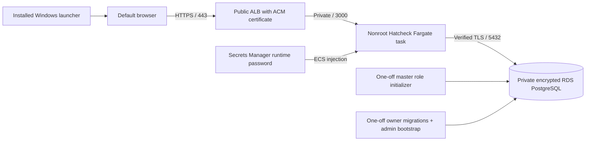

# Central Hatcheck on AWS

This prepares a **new, empty deployment**. It does not connect to an AWS
account, create resources, publish an image, or change a live database by
itself. Review the Terraform plan and obtain deployment approval before
applying it: ALB, NAT, public IPv4, Fargate, RDS, storage/backups, logs, and
Secrets Manager all incur ongoing charges even when the service is disabled.

Windows users install the hosted-server MSI, which opens the canonical HTTPS
address in their browser. The PC does not run a database/server, receive AWS
credentials, or connect directly to RDS. Everyone uses the same server and
database; internet/VPN connectivity is required.



## Inputs and prerequisites

- A commercial AWS account and a region with two available AZs, Fargate, and
  RDS PostgreSQL 17. Select a region close to staff and consistent with your
  organization's data requirements; none is selected on your behalf.
- AWS CLI v2 authenticated as a deployment operator, preferably through AWS
  SSO. The operator needs VPC/ALB/RDS/ECR/ECS/CloudWatch/IAM/Secrets Manager
  administration and tightly scoped `iam:PassRole` for the roles in this
  plan. No access keys go into the repository or MSI.
- Terraform >=1.11,<2, Docker with Linux/amd64 builds, Python 3.10+, OpenSSL.
- A domain/subdomain you control and a **validated ACM certificate** in the
  selected region/account covering that hostname. Certificate/DNS ownership
  is external to this configuration. Wildcard or explicit certificates work.
- Either an existing Route 53 public zone ID, or permission to create an ALB
  DNS alias/CNAME through your DNS provider. Set `APP_URL` through
  `domain_name`; the MSI must point to exactly this HTTPS origin.
- Your office/VPN IPv4 egress networks for `allowed_ingress_cidrs`. Public
  internet access is an explicit `0.0.0.0/0` choice; the example uses the
  reserved documentation network and will not admit real staff.

Copy `terraform.tfvars.example` to `terraform.tfvars`, replace every example,
and keep `service_enabled=false`. Choose an immutable `image_tag` tied to the
reviewed source version. `.tfvars` files and local state/plans are ignored by
Git and excluded from the Docker context. No password values are Terraform
inputs/resources/outputs. RDS creates and manages its master password;
random role/admin password values are written directly to Secrets Manager.

Use a private, versioned, encrypted S3 state bucket with locking for a shared
deployment. `backend.tf.example` shows the optional backend; its bucket must
already exist and be reviewed separately. Local state works for preparation
but must be secured/backed up and never committed. State still contains
infrastructure details and secret ARNs, even without password values.

## Review, then provision the disabled infrastructure

Run these yourself after choosing the account/region/domain:

```sh
aws sts get-caller-identity
terraform -chdir=infra/aws init
terraform -chdir=infra/aws fmt -check
terraform -chdir=infra/aws validate
terraform -chdir=infra/aws test
terraform -chdir=infra/aws plan -out=infrastructure.tfplan
terraform -chdir=infra/aws show infrastructure.tfplan
```

`terraform test` uses a mocked provider and never contacts/provisions AWS.
The real plan reads your selected account. Review cost, CIDRs, region,
certificate, IAM permissions, retention, and availability before approval.
Only after approval:

```sh
terraform -chdir=infra/aws apply infrastructure.tfplan
```

This creates a VPC across two AZs, private app/database subnets, an HTTPS ALB,
ECR, ECS task definitions, RDS, logs, roles, and empty password-secret
containers. The service has **zero tasks**: an absent image/uninitialized
database does not cause a crash loop. The database has no Internet route,
public address, or staff-client ingress; only the ECS security group can
reach port 5432. Fargate accepts port 3000 only from the ALB security group.
Outbound HTTPS through NAT supports image/log/secret delivery and optional
future identity-provider traffic.

The pilot defaults to one NAT gateway, one application process, and single-AZ
RDS. Enable `nat_gateway_per_az` and `db_multi_az` for independent AZ egress
and database failover after reviewing cost. These switches do not create
multiple application workers. CloudWatch log retention defaults to 30 days;
application audit/history records are retained in RDS.

## Build, initialize, and activate

1. Fetch the official RDS CA with normal HTTPS verification. See
   [CA provenance](rds-ca/README.md). Review the certificate subjects, expiry,
   and recorded digest before the build. The current cloud network returns
   HTTP 403 for the official truststore; fetch on an allowed network. Neither
   the application nor helper disables TLS to work around it.

   ```sh
   python3 scripts/aws/fetch-rds-ca.py
   openssl crl2pkcs7 -nocrl -certfile infra/aws/rds-ca/global-bundle.pem | openssl pkcs7 -print_certs -noout
   ```

2. Store independent random owner, runtime, and initial-admin passwords.
   Existing current values are retained; this action does not rotate them or
   print them. Retrieve the initial-admin value through Secrets Manager's
   authenticated console when handing it to the initial administrator.

   ```sh
   python3 scripts/aws/deploy.py prepare-secrets
   python3 scripts/aws/deploy.py publish-image
   ```

   Image builds use Linux/amd64 and the existing frozen-lockfile Dockerfile.
   The helper requires the CA/checksum, sends the ECR login token through
   stdin using a temporary Docker credential directory, pushes an immutable
   tag, and removes the temporary credential directory. Review the ECR scan
   findings before continuing. A private build-network CA can be supplied
   through the Dockerfile's existing BuildKit secret when doing a manual
   reviewed build; never put that CA or credentials in the image.

3. Initialize the new dedicated RDS database, then migrate/bootstrap it.

   ```sh
   python3 scripts/aws/deploy.py initialize
   ```

   The initializer uses the RDS-managed master only in its one-off task,
   creates restricted `hatcheck_owner` and `hatcheck_app` roles, and transfers
   database/schema ownership. It works with a PostgreSQL nonsuperuser master
   that has CREATEROLE/CREATEDB. PostgreSQL 17's automatic creator ADMIN grant
   is retained while INHERIT/SET membership permits ownership changes.
   Existing role privilege flags/inherited memberships are checked and
   refused if unsafe. Passwords become SCRAM verifiers before SQL, so utility
   statements do not contain plaintext passwords.

   The owner task then applies migrations, creates the chosen initial admin,
   and grants runtime permissions while revoking rewrite permissions on
   audit/custody/document-revision history. The admin password is supplied
   from Secrets Manager and **is not printed to CloudWatch**. No seed assets,
   locations, or sample users are created. Initializer and migrator share an
   advisory lock; runtime secret access excludes owner/master/admin secrets.
   Runtime startup skips both migrations and bootstrap.

   The helper refuses active/draining service tasks, launches one task at a
   time, waits for its actual STOPPED status, and requires exit code zero.
   Failed image pulls, secret delivery, TLS, role initialization, or migrations
   block activation. Inspect the selected CloudWatch stream without copying
   secret-bearing diagnostic SQL. RDS statement text/duration logging is
   disabled to keep authentication verifiers out of operational logs; error
   messages remain available. Do not enable statement logging for this task.

4. Point DNS at the ALB (automatic with `route53_zone_id`). Immediately create
   and review the activation plan:

   ```sh
   python3 scripts/aws/deploy.py activation-plan
   terraform -chdir=infra/aws show activation.tfplan
   ```

   A local nonsecret receipt binds the successful migration task to the
   current immutable image and task definition. The helper rechecks AWS's
   recorded zero exit and rejects plans changing other infrastructure/image
   inputs. ECS retains stopped tasks for a limited period; if the verification
   has expired, rerun the idempotent `migrate` action with the service stopped.
   After activation approval, apply the reviewed plan and set
   `service_enabled=true` in your local `.tfvars` so subsequent plans retain
   the running service:

   ```sh
   terraform -chdir=infra/aws apply activation.tfplan
   python3 scripts/aws/deploy.py check
   ```

   `check` requires one stable worker on the intended runtime definition and
   database-backed HTTPS readiness with normal certificate verification.
   Log in using `initial_admin_email` and its secret, change that password,
   create the remaining accounts, and test an audited asset/custody/SOP flow.
   The initial-admin secret is a bootstrap value; it does not track later
   account password changes. Build the MSI with this exact HTTPS address.

## Availability and limits

Sessions live in PostgreSQL, so the ALB needs no sticky routing. The current
login/OIDC attempt limits are per-process memory: this configuration pins one
steady-state worker and has no autoscaling. A rolling replacement can briefly
run two workers and a restart resets counters. Add a shared limiter before
scaling out; this is distinct from database session persistence.

ALB `/api/v1/ready` checks the database; ECS `/api/v1/live` checks the process.
A database outage removes targets without restarting healthy processes in a
loop. Long atomic database work can temporarily delay readiness. Fargate
drains for 30 seconds; the application has bounded HTTP/database shutdown.
The root filesystem is read-only. Its only writable ephemeral volume is
`/app/runtime-tmp`, with image-declared Bun ownership for migrations; all
durable application data is in RDS.

The ALB appends the client IP to forwarded headers. Hatcheck trusts forwarded
addresses only when the actual peer is in the two ALB subnet CIDRs; the app
security group prevents clients/other resources from bypassing the ALB.
Keep those subnet ranges reserved for the ALB. The MSI contains the service
address only, never a PostgreSQL endpoint/password or AWS credential.

## Updates, backup, restore, and retirement

Updates use a **new immutable image tag**. For this pilot, schedule a short
maintenance window: review/apply `service_enabled=false`, wait for all old
tasks to stop, take a manual RDS snapshot, then review/apply the new tag with
the service still disabled. Fetch/review CA changes if needed, publish the
image, run `python3 scripts/aws/deploy.py migrate`, and repeat the activation
plan/approval/check sequence. This intentionally avoids new schema migrations
running under old workers. Rolling runtime replacements can still briefly
overlap when only the task definition changes without a maintenance stop.

RDS keeps 14 days of automated backups/PITR and copies tags to snapshots.
Test a restore to a **separate** RDS instance in the private subnet/security
group. RDS snapshots preserve the owner/runtime roles and stored password
verifiers; securely align the restored instance's Secrets Manager values,
test TLS/login/audit history, and run owner migrations before cutover. Review
the separate restore/cutover Terraform plan and retain the original database
until acceptance. Do not replace a live database with an untested restore.
The existing [operations guide](../../docs/OPERATIONS.md) covers logical
PostgreSQL backups and application retention/recovery.

This scaffolding creates a new database. It does **not** transfer an existing
SQLite installation's full audit/custody/SOP history. Keep a verified backup
of any local database and plan/test that separate transfer before replacing
a populated installation; CSV asset import alone is not a complete migration.

RDS and ALB deletion protection, Terraform `prevent_destroy` on durable
database/secrets/ECR, and retained backups intentionally block casual
`terraform destroy`. Decommission only after an approved retention/backup
plan; review explicit protection changes and select a unique final snapshot
name. Rotating database-role secrets also requires applying the new verifier
through the stopped-service initializer before restarting workers; there is
no automatic runtime-role rotation hook in this pilot.

## Recorded preparation checks

Terraform formatting/validation and two mocked safety runs verify the initial
zero-task gate, private encrypted/protected backups, private Fargate addresses,
restricted secret delivery, verifying TLS, scoped proxy trust, initialization
skip flags, and nonroot/read-only process health. Ten Python tests cover task
failures, zero-exit gating, draining tasks, private secret payload cleanup,
existing-secret preservation, CA hash rejection, and image-change activation
blocking. Local PostgreSQL 17 tests simulate a nonsuperuser RDS master and
verify fresh/repeated initialization, special-character password login,
owner migrations, restricted audited runtime writes, and inherited-role
rejection. These checks do not claim a live AWS deployment or Windows execution.
